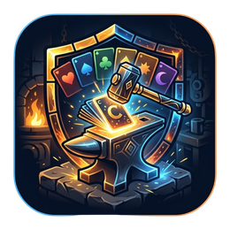
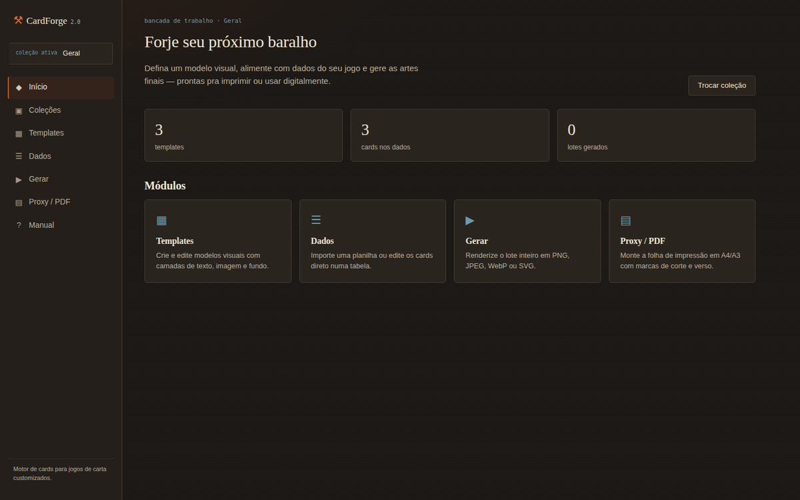
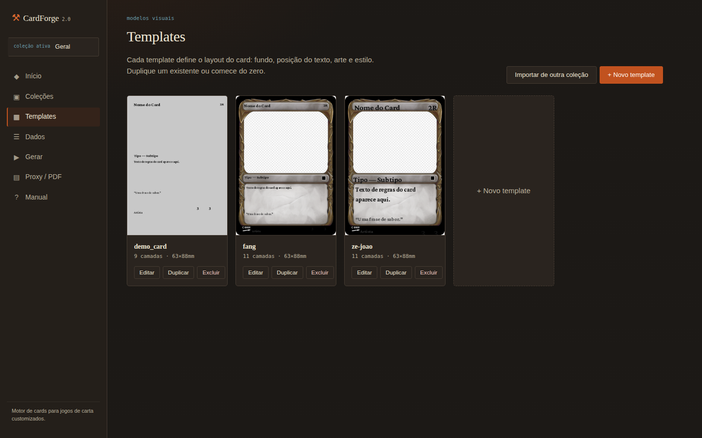
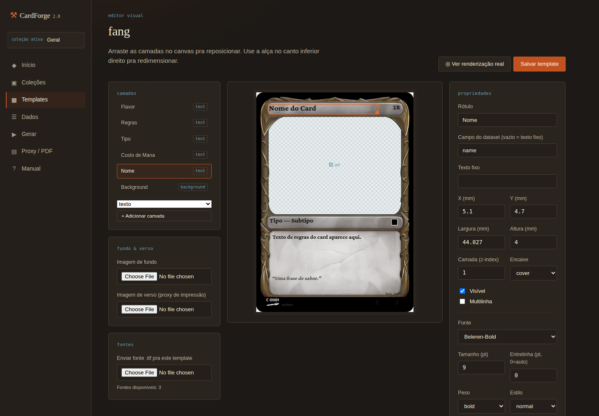
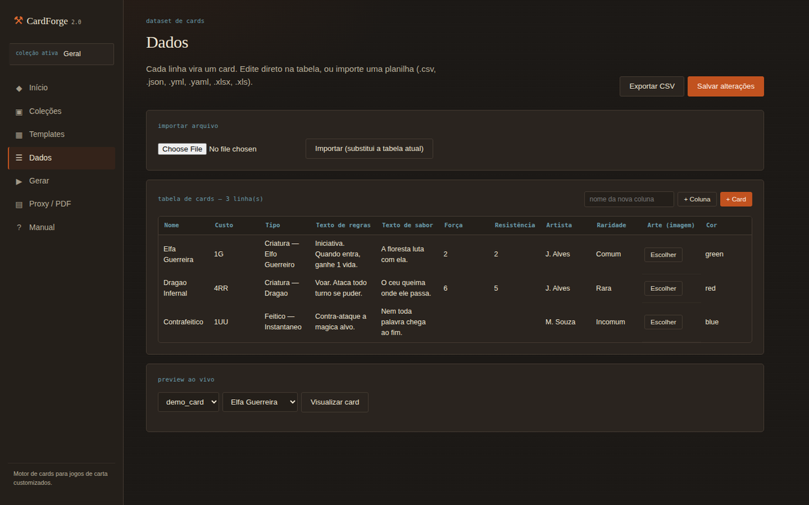
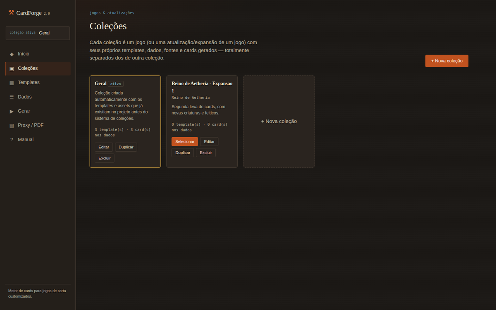
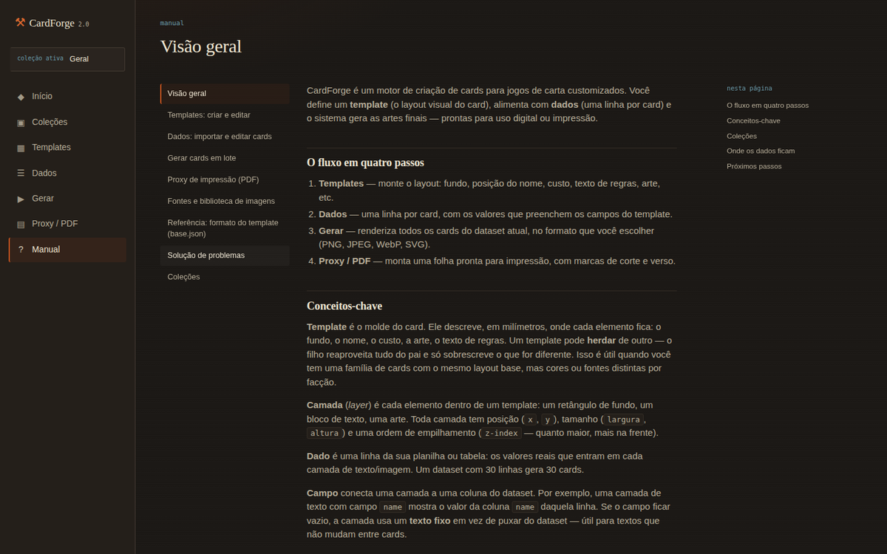

<p align="center">
  
</p>

<h1 align="center">CardForge 2.0</h1>

<p align="center">
  <strong>Um motor open source pra criar cards de jogos de carta customizados — do seu jeito, na sua mesa, na sua comunidade.</strong>
</p>

<p align="center">
  <a href="LICENSE"></a>
  
  
  <a href="#contribuindo"></a>
</p>

<p align="center">
  
</p>

---

## Sobre

Todo mundo que já amou um jogo de cartas em algum momento pensou "e se eu criasse o meu". O **CardForge** existe pra isso: é a ferramenta que faltava pra sair da ideia rabiscada no caderno e chegar num baralho de verdade — com layout consistente, arte encaixada, texto de regras formatado e uma folha pronta pra imprimir e jogar com os amigos.

Não é um app fechado, não exige conta, não trava seu trabalho atrás de paywall. É **código aberto**, roda na sua máquina, seus dados ficam no seu disco, em arquivos simples que você pode versionar, copiar ou compartilhar do jeito que quiser. Se você é do tipo que cria fangames, expansões caseiras de TCGs, RPGs de mesa com cartas próprias, ou só quer materializar aquele jogo que existe na sua cabeça há anos — este projeto é pra você, e esperamos que a comunidade ao redor dele cresça com contribuições, templates e ideias de quem também ama esse hobby.

> Este projeto é a refatoração 2.0 do [CardForge original](https://github.com/ChristopherNicolasSMM/Criador_de_Cards_Beta_CardForge) (desktop/Tkinter). O motor de renderização foi reaproveitado quase intacto — a virada da 2.0 foi levar tudo pro navegador e organizar o trabalho em **Coleções**.

---

## Por que usar

- 🎨 **Editor visual de verdade** — arraste, redimensione e estilize camadas de texto, arte e fundo direto no navegador, sem editar JSON na mão.
- 🗂️ **Coleções** — cada jogo (ou cada atualização/expansão de um jogo) vive isolado em sua própria pasta: templates, dados, fontes e cards gerados nunca se misturam entre projetos diferentes.
- 📋 **Dados sem fricção** — importe uma planilha (CSV/XLSX/YAML/JSON) ou edite os cards direto numa tabela no navegador.
- 🖨️ **Pronto pra jogar de verdade** — geração em lote (PNG/JPEG/WebP/SVG) e uma folha de proxy pra impressão (A4/A3/Letter) com marcas de corte e verso.
- 📖 **Manual embutido** — um wiki em `/wiki`, dentro do próprio app, documentando cada tela.
- 🧩 **Extensível** — herança de templates, fontes customizadas, importação de modelos entre coleções.
- 🔓 **100% seu** — sem banco de dados, sem servidor externo, sem telemetria. Arquivos no disco, sob licença MIT.

---

## Início rápido

```bash
git clone https://github.com/ChristopherNicolasSMM/CardForge_v2.git
cd CardForge_v2
pip install -r requirements.txt
python run.py
```

Abra **http://localhost:5000** — o app cria sua primeira coleção pra você começar a forjar.

---

## Um tour rápido

<table>
<tr>
<td width="50%">

**Galeria de templates**
Crie, duplique ou herde modelos de card. Cada um é um layout completo — fundo, texto, arte, custo.



</td>
<td width="50%">

**Editor visual**
Arraste camadas no canvas, ajuste fonte/cor/tamanho no painel lateral e confira a renderização real com um clique.



</td>
</tr>
<tr>
<td width="50%">

**Dados em tabela**
Importe uma planilha ou monte os cards direto na interface — com biblioteca de imagens e preview ao vivo.



</td>
<td width="50%">

**Coleções**
Um jogo, ou uma expansão de um jogo — cada um isolado em sua própria pasta, com opção de duplicar ou importar templates entre eles.



</td>
</tr>
</table>

E um manual completo, sempre à mão, dentro do próprio app:

<p align="center"></p>

---

## O que mudou da 1.0 para a 2.0

| | 1.0 (Tkinter) | 2.0 (Flask) |
|---|---|---|
| Interface | Janela desktop | Navegador (qualquer sistema operacional) |
| Editor de template | Canvas Tkinter | Canvas HTML5 com drag & drop |
| Organização do trabalho | Um projeto solto, sem separação | **Coleções** — um jogo (ou atualização de jogo) por pasta, isolados |
| Dataset | Só arquivo (CSV/XLSX/YAML/JSON) | Arquivo **ou** tabela editável no navegador |
| Imagens de arte | Caminho digitado manualmente | Biblioteca visual + upload direto |
| Fontes | Fixas (Beleren/Mplantin) | Upload de `.ttf`, por template ou por coleção |
| Geração em lote | Só local | Resultado em grade com download individual ou `.zip` |
| Proxy de impressão | Sim (A4/A3/Letter + verso) | Mantido, com upload de verso pela interface |
| Documentação | Arquivos `.md` soltos no repositório | Wiki navegável dentro do próprio app (`/wiki`) |
| Persistência | Arquivos no disco | Arquivos no disco, organizados por coleção (ainda sem banco de dados) |

O motor (`core/`) é o mesmo pipeline desde a 1.0: **Template (JSON com herança) + Dados → Renderização (PIL/SVG) → Export (PNG/JPEG/WebP/SVG) → Proxy PDF**. A 2.0 trocou a casca (Tkinter → Flask) e organizou o trabalho em coleções — a lógica de geração de cards continua sendo a mesma, testada, do projeto original.

---

## Coleções: um jogo, ou uma atualização de jogo

Cada coleção é uma pasta autocontida — templates, dados, fontes e cards gerados de uma coleção nunca se misturam com os de outra:

```
collections/<coleção>/
  collection.json      ← nome, descrição, jogo
  templates/<nome>/     ← modelos de card dessa coleção
  assets/library/         ← imagens de arte enviadas
  assets/fonts_custom/     ← fontes .ttf enviadas
  data.json                 ← dataset de cards em edição
  output/                    ← lotes gerados + PDFs de proxy
```

- **Duplicar** uma coleção (pra criar uma atualização/expansão) deixa você escolher o que trazer: templates, fontes/imagens e/ou os dados já cadastrados.
- **Importar um template** de outra coleção copia aquele modelo pra coleção atual, mantendo as duas independentes depois.

Manual completo em `/wiki` → **Coleções**, dentro do app.

---

## Estrutura do projeto

```
cardforge2/
├── core/                     ← motor de renderização (sem nenhuma dependência de UI)
│   ├── template/               → modelos, herança, carregar/salvar template
│   ├── data/                   → leitura de CSV/XLSX/YAML/JSON
│   ├── render/                 → preview PIL, SVG builder, export raster, resolução de fontes
│   └── proxy/                  → composição de folha + PDF
│
├── web/                      ← camada Flask
│   ├── routes/                  → blueprints: hub, coleções, templates, dados, gerar, proxy, wiki
│   ├── services/                 → coleções, upload de assets, dataset
│   ├── templates/                → HTML (Jinja2)
│   └── static/                   → CSS + JS (editor de canvas, tabela de dados)
│
├── collections/                ← cada coleção (jogo, ou atualização de jogo) é uma pasta aqui
├── assets/fonts/                ← fontes embutidas no CardForge (globais, todas as coleções)
├── docs/                        ← manuais em .md, exibidos em /wiki
├── requirements.txt
└── run.py
```

---

## Fluxo de uso

0. **Coleções** — crie (ou selecione) a coleção do jogo em que vai trabalhar.
1. **Templates** — crie um modelo novo (ou duplique/herde um existente) e edite visualmente.
2. **Dados** — importe uma planilha ou monte a tabela direto no navegador.
3. **Gerar** — escolha o template e os formatos de saída, gere o lote inteiro.
4. **Proxy / PDF** — monte a folha de impressão, pronta pra jogar com sleeves ou proxies.

Detalhes de cada etapa estão no manual embutido (`/wiki`), incluindo o formato técnico do template pra quem quiser editar o `base.json` na mão.

---

## Notas técnicas

- **Sem banco de dados** — tudo é arquivo, organizado por coleção. Cada coleção é uma pasta que você pode copiar, arquivar ou versionar isoladamente.
- **Geração síncrona** — a geração em lote roda na mesma requisição. Pra datasets muito grandes (várias centenas de cards), gere em lotes menores.
- **Fontes**: ordem de busca é `templates/<nome>/fonts/` (da coleção ativa) → `collections/<coleção>/assets/fonts_custom/` → `assets/fonts/` (embutidas, globais).
- **Migração automática**: projetos criados antes do sistema de coleções têm templates/assets migrados automaticamente pra uma coleção "Geral" na primeira execução após a atualização.

---

## Contribuindo

Esse projeto é feito **por e para quem gosta de jogos de carta** — se você criou um template legal, achou um bug, tem uma ideia de funcionalidade ou quer melhorar a documentação, contribuições são bem-vindas:

1. Faça um fork e crie uma branch a partir da `main`.
2. Rode o projeto localmente (`pip install -r requirements.txt && python run.py`) e valide sua mudança.
3. Abra um Pull Request descrevendo o que mudou e por quê.

Ideias de contribuição que ajudam bastante: templates prontos pra diferentes estilos de jogo, traduções, melhorias de acessibilidade, ou só um relato de bug bem detalhado.

---

## Licença

Este projeto é open source sob a **licença MIT** — veja [`LICENSE`](LICENSE). Em resumo: use, copie, modifique, redistribua, inclusive comercialmente, com atribuição e sem garantias. É software livre pra comunidade de jogos de carta usar e evoluir.

> Se você usar o CardForge pra criar cards inspirados em jogos de terceiros (Magic: The Gathering e afins), lembre-se de que a licença cobre **o software**, não os direitos autorais do jogo original — use pra fins pessoais/fan-made e respeite a propriedade intelectual de terceiros.

---

<p align="center">
  Desenvolvido por <strong>Christopher N. S. M. Mauricio</strong> — com carinho por quem também sonha em ver seu próprio jogo de cartas na mesa.
</p>
